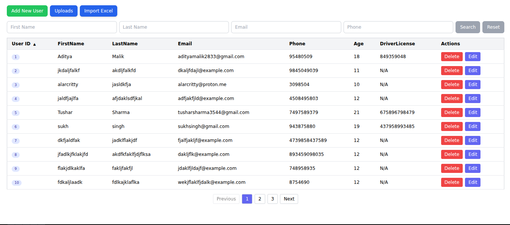
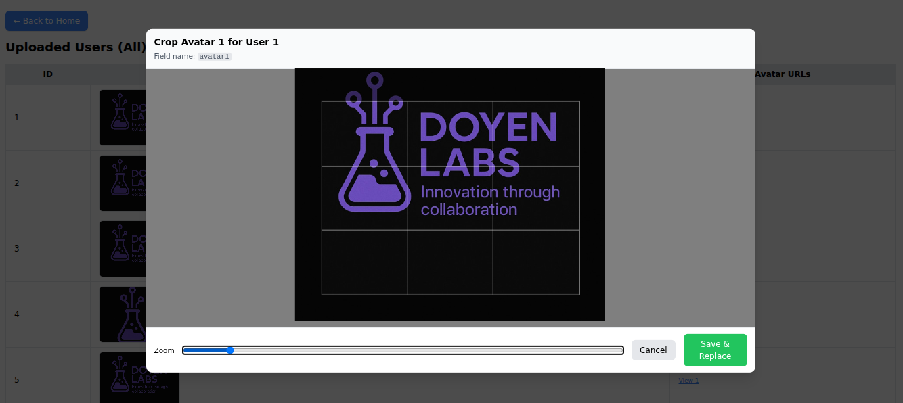
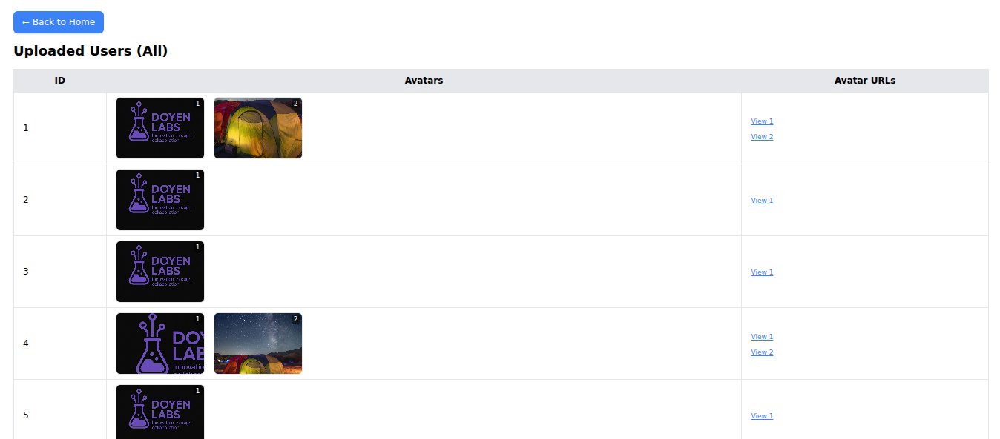

# User Management System

A full-stack web application for managing user data with CRUD operations, avatar uploads, Excel import, search functionality, and pagination.

## Screenshots

### Main Interface
  
*Shows user table with search, sort, and pagination controls.*

### Crop

*Upload up to 5 avatars per user. Existing avatars can be cropped or replaced individually.*

### Upload Page


---

## Features

- **User Management**
  - Create, read, update, delete user records
  - Validation rules: required fields, age checks, driver license requirement (18+), email format check
- **Avatar Management**
  - Upload up to 5 avatars per user (`avatar1`–`avatar5`)
  - Temporary folder support for new users before saving
  - Automatic cleanup of old avatars when replaced
  - URLs automatically included in API responses
- **Excel Import**
  - Upload `.xlsx` or `.xls` file with user data
  - Validation for required fields, email format, age, driver license
  - Summary of created and failed rows returned
- **Bulk User Creation**
  - Create multiple users at once using a JSON array
- **Advanced Search**
  - Filter by first name, last name, email, or phone number
- **Sorting**
  - Sort users by ID, name, email, age, etc.
- **Pagination**
  - Navigate through users efficiently
- **Responsive Design**
  - Mobile-friendly interface with Tailwind CSS

---

## Tech Stack

### Frontend
- **React 18** – Hooks-based architecture
- **Tailwind CSS** – Modern utility-first styling
- **Vite** – Fast dev/build tool

### Backend
- **Node.js** + **Express.js**
- **MongoDB** with **Mongoose ODM**
- **Multer** – File upload handling
- **XLSX** – Excel processing

### Utilities
- **CORS** – Cross-origin requests
- **dotenv** – Environment variable management
- **uuid** – Unique temp folder IDs for new users

---

## Project Structure

```
user-management-system/
├── backend/
│   ├── src/
│   │   ├── controllers/
│   │   │   └── user.controllers.js
│   │   ├── middlewares/
│   │   │   └── multer.middlewares.js
│   │   ├── models/
│   │   │   └── user.models.js
│   │   ├── routes/
│   │   │   └── user.routes.js
│   │   └── index.js
│   ├── uploads/   # Avatar & Excel storage
│   ├── package.json
│   └── pnpm-lock.yaml
└── frontend/
    ├── src/
    │   ├── components/
    │   │   ├── Header.jsx
    │   │   └── userTable.jsx
    │   ├── Operations/
    │   │   └── PostForm.jsx
    │   ├── App.jsx
    │   └── main.jsx
    ├── public/
    ├── package.json
    ├── tailwind.config.js
    ├── vite.config.js
    └── index.html
```

---

## Getting Started

### Prerequisites
- Node.js **v16+**
- pnpm or npm
- MongoDB Atlas account (or local MongoDB)

### Installation

1. **Clone the repository**
   ```bash
   git clone git@github.com:alarcritty/data-table.git
   cd data-table
   ```

2. **Backend Setup**
   ```bash
   cd backend
   npm install
   ```

3. **Frontend Setup**
   ```bash
   cd ../frontend
   pnpm install
   ```

---

### Environment Configuration

Create `.env` in `/backend`:

```env
PORT=3000
MONGO_URI=mongodb+srv://<username>:<password>@cluster0.mongodb.net/test
CORS_ORIGIN=*
```

---

### Running the Application

1. **Start Backend**
   ```bash
   cd backend
   pnpm run dev
   # or
   node src/index.js
   ```
   Runs on: `http://localhost:3000`

2. **Start Frontend**
   ```bash
   cd frontend
   pnpm dev
   ```
   Runs on: `http://localhost:5173`

---

## API Endpoints

### Users API (`/api/users`)

#### Get Users
**GET** `/api/users`

Query params: `page`, `limit`, `sortBy`, `order`, `firstName`, `lastName`, `email`, `phone`

#### Get User by ID
**GET** `/api/users/:id`

#### Create User
**POST** `/api/users`

- Accepts JSON body or multipart form (with avatars)
- If body is an **array**, bulk creation is triggered

#### Update User
**PUT** `/api/users/:id`

#### Partial Avatar Update
**PATCH** `/api/users/:id`

- Upload one avatar field (`avatar1`–`avatar5`) at a time
- Requires `avatarField` in body

#### Delete User
**DELETE** `/api/users/:id`

---

### Excel Upload Endpoint

#### Upload Users via Excel
**POST** `/api/users/upload-excel`

- `multipart/form-data` → field: `excelFile`
- File type: `.xlsx` or `.xls`

Example:
```bash
curl -X POST http://localhost:3000/api/users/upload-excel \
     -F "excelFile=@users.xlsx"
```

Response:
```json
{
  "success": true,
  "message": "Excel processing complete: 3 users created, 1 failed",
  "summary": { "totalRows": 4, "successful": 3, "failed": 1 },
  "createdUsers": [
    { "id": "66a...", "firstName": "Alice", "lastName": "Smith" }
  ],
  "failedUsers": [
    { "rowIndex": 4, "error": "Driver License required for age 18+" }
  ]
}
```

---

## File Upload Rules

### Avatars
- Max 5 avatars per user
- Max size: **5MB per file**
- Allowed: `jpeg`, `jpg`, `png`, `gif`
- Filenames are unique with user ID + timestamp

### Excel Files
- Max size: **10MB**
- Allowed: `.xlsx`, `.xls`
- Stored temporarily in `uploads/excel/`
- Auto-deleted after processing

---

## Validation Rules

- `firstName`, `lastName`, `email`, `phone`, `age` → required
- `age`: 0–120 only
- `driverLicense`: required if `age >= 18`
- `email`: must be valid format
- `phone`: must be numeric

---

## File Management

### Temp Folders
- New users use `uploads/temp_<uuid>`
- Files moved to `uploads/user_<id>` once saved

### Cleanup
- Old avatars auto-deleted on replacement
- On user deletion, all related files/folder are removed
- Temporary uploads removed if user creation fails

### Excel Files
- Deleted immediately after processing

---

## UI Features

- Responsive design with Tailwind
- Live updates after CRUD operations
- Avatar preview and crop functionality
- Excel upload summary page
- Modern React hooks architecture

---

## Security Notes

- Use environment variables for DB connection
- Add authentication & authorization before production
- Validate user input more strictly
- HTTPS recommended for production
- Consider rate limiting for APIs

---
## Contributing

1. Fork the repository
2. Create your feature branch (`git checkout -b feature/amazing-feature`)
3. Commit your changes (`git commit -m 'Add some amazing feature'`)
4. Push to the branch (`git push origin feature/amazing-feature`)
5. Open a Pull Request

---

## License

This project is licensed under the MIT License - see the [LICENSE](LICENSE) file for details.

---

## Support

If you encounter any issues or have questions, please [open an issue](https://github.com/alarcritty/data-table/issues) on GitHub.
